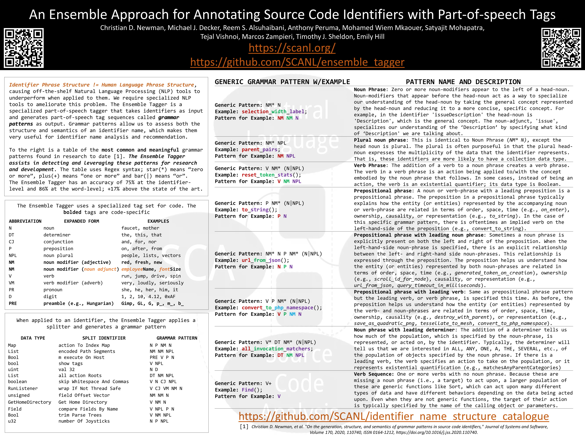

SCANL has several publications, posters, and talks going on at ICSE, ICPC, NLBSE, and MSR 2022! Click here for more information what what we will be up to!

<!--more-->
We are presenting a few posters:

We also have several video presentations, you can find those here:

**Crafting Better Identifier Names for Source Code: A part-of-speech tagger for identifiers - Journal First Track**

<iframe width="560" height="315" src="https://www.youtube.com/embed/LslNjnh1f54" title="YouTube video player" frameborder="0" allow="accelerometer; autoplay; clipboard-write; encrypted-media; gyroscope; picture-in-picture" allowfullscreen></iframe>

**Understanding Digits in Identifier Names: An Exploratory Study - NLBSE 2022**
<iframe width="560" height="315" src="https://www.youtube.com/embed/ERD6GTFzOxY" title="YouTube video player" frameborder="0" allow="accelerometer; autoplay; clipboard-write; encrypted-media; gyroscope; picture-in-picture" allowfullscreen></iframe>

**Refactoring Debt: Myth or Reality? An Exploratory Study on the Relationship Between Technical Debt and Refactoring - MSR 2022**
<iframe width="560" height="315" src="https://www.youtube.com/embed/Z_OSZOVYrLc" title="YouTube video player" frameborder="0" allow="accelerometer; autoplay; clipboard-write; encrypted-media; gyroscope; picture-in-picture" allowfullscreen></iframe>

**How Do I Refactor This? An Empirical Study on Refactoring Trends and Topics in Stack Overflow - Journal First Track**
<iframe width="560" height="315" src="https://www.youtube.com/embed/suWRL2nmxMs" title="YouTube video player" frameborder="0" allow="accelerometer; autoplay; clipboard-write; encrypted-media; gyroscope; picture-in-picture" allowfullscreen></iframe>

You can find information about what we're presenting on the ICSE webpage:

Christian: https://conf.researchr.org/profile/icse-2022/christiannewman

Anthony: https://conf.researchr.org/profile/icse-2022/anthonyperuma

Reem: https://conf.researchr.org/profile/icse-2022/reemalsuhaibani

