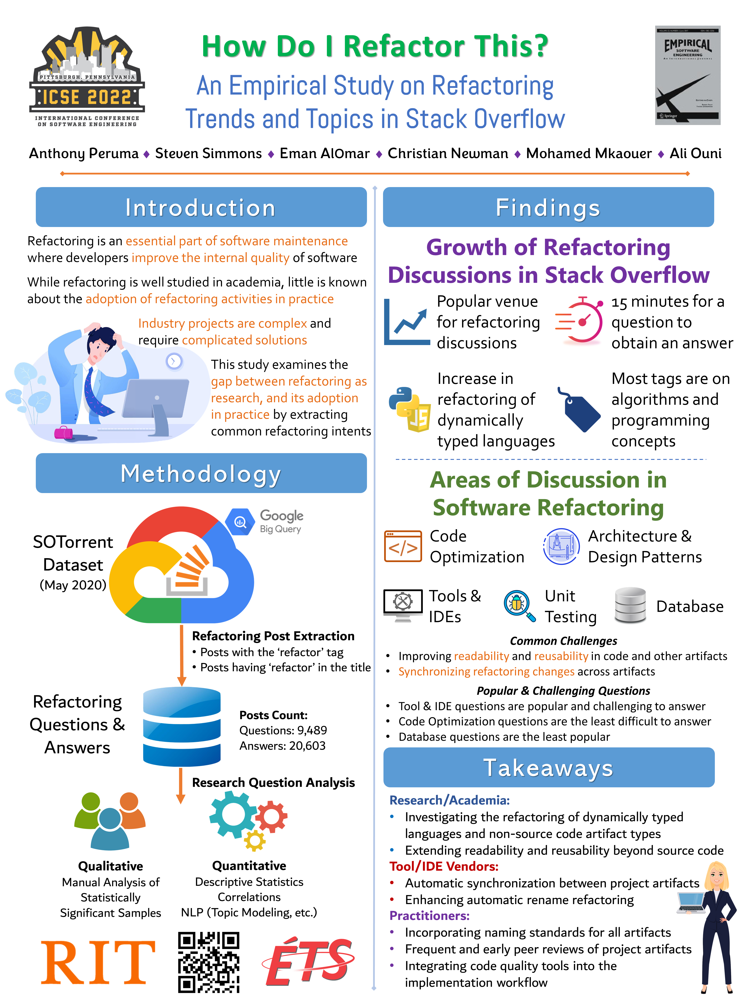

SCANL has several publications, posters, and talks going on at ICSE, ICPC, NLBSE, and MSR 2022! Click here for more information what what we will be up to!

<!--more-->
The schedule for our **in-person** presentations is below.

| **Venue** |                                                        **Presentation**                                                       | **Date** | **Time** | **Location** |   **Presenter**  |
|:---------:|:-----------------------------------------------------------------------------------------------------------------------------:|:--------:|:--------:|:------------:|:----------------:|
| MSR       | POSTER: Refactoring Debt: Myth or Reality? An Exploratory Study on the Relationship Between Technical Debt and Refactoring | 23-May   | 15:30    | Room 315+316 | Anthony Peruma   |
| MSR       | PAPER: Refactoring Debt: Myth or Reality? An Exploratory Study on the Relationship Between Technical Debt and Refactoring  | 24-May   | 09:53    | Room 315+316 | Anthony Peruma   |
| ICSE      | PAPER: An Ensemble Approach for Annotating Source Code Identifiers with Part-of-speech Tags                                | 25-May   | 11:20    | Room 304+305 | Christian Newman |
| ICSE      | POSTER: An Ensemble Approach for Annotating Source Code Identifiers with Part-of-speech Tags                               | 25-May   | 13:30    | Ballroom B   | Christian Newman |
| ICSE      | Birds of a Feather: Crafting Identifier Names                                                                              | 25-May   | 16:30    | Room 301+302 | Christian Newman |
| ICSE      | PAPER: How Do I Refactor This? An Empirical Study on Refactoring Trends and Topics in Stack Overflow                       | 27-May   | 11:15    | Room 306+307 | Anthony Peruma   |
| ICSE      | POSTER: How Do I Refactor This? An Empirical Study on Refactoring Trends and Topics in Stack Overflow                      | 27-May   | 13:30    | Ballroom B   | Anthony Peruma   |

Below are copies of the posters and presentations:

We also have several video presentations, you can find those here:

**Crafting Better Identifier Names for Source Code: A part-of-speech tagger for identifiers - Journal First Track**

<iframe width="560" height="315" src="https://www.youtube.com/embed/LslNjnh1f54" title="YouTube video player" frameborder="0" allow="accelerometer; autoplay; clipboard-write; encrypted-media; gyroscope; picture-in-picture" allowfullscreen></iframe>

**Understanding Digits in Identifier Names: An Exploratory Study - NLBSE 2022**
<iframe width="560" height="315" src="https://www.youtube.com/embed/ERD6GTFzOxY" title="YouTube video player" frameborder="0" allow="accelerometer; autoplay; clipboard-write; encrypted-media; gyroscope; picture-in-picture" allowfullscreen></iframe>

**Refactoring Debt: Myth or Reality? An Exploratory Study on the Relationship Between Technical Debt and Refactoring - MSR 2022**
<iframe width="560" height="315" src="https://www.youtube.com/embed/Z_OSZOVYrLc" title="YouTube video player" frameborder="0" allow="accelerometer; autoplay; clipboard-write; encrypted-media; gyroscope; picture-in-picture" allowfullscreen></iframe>

**How Do I Refactor This? An Empirical Study on Refactoring Trends and Topics in Stack Overflow - Journal First Track**
<iframe width="560" height="315" src="https://www.youtube.com/embed/suWRL2nmxMs" title="YouTube video player" frameborder="0" allow="accelerometer; autoplay; clipboard-write; encrypted-media; gyroscope; picture-in-picture" allowfullscreen></iframe>

You can find information about what we're presenting on the ICSE webpage:

Christian: https://conf.researchr.org/profile/icse-2022/christiannewman

Anthony: https://conf.researchr.org/profile/icse-2022/anthonyperuma

Reem: https://conf.researchr.org/profile/icse-2022/reemalsuhaibani

